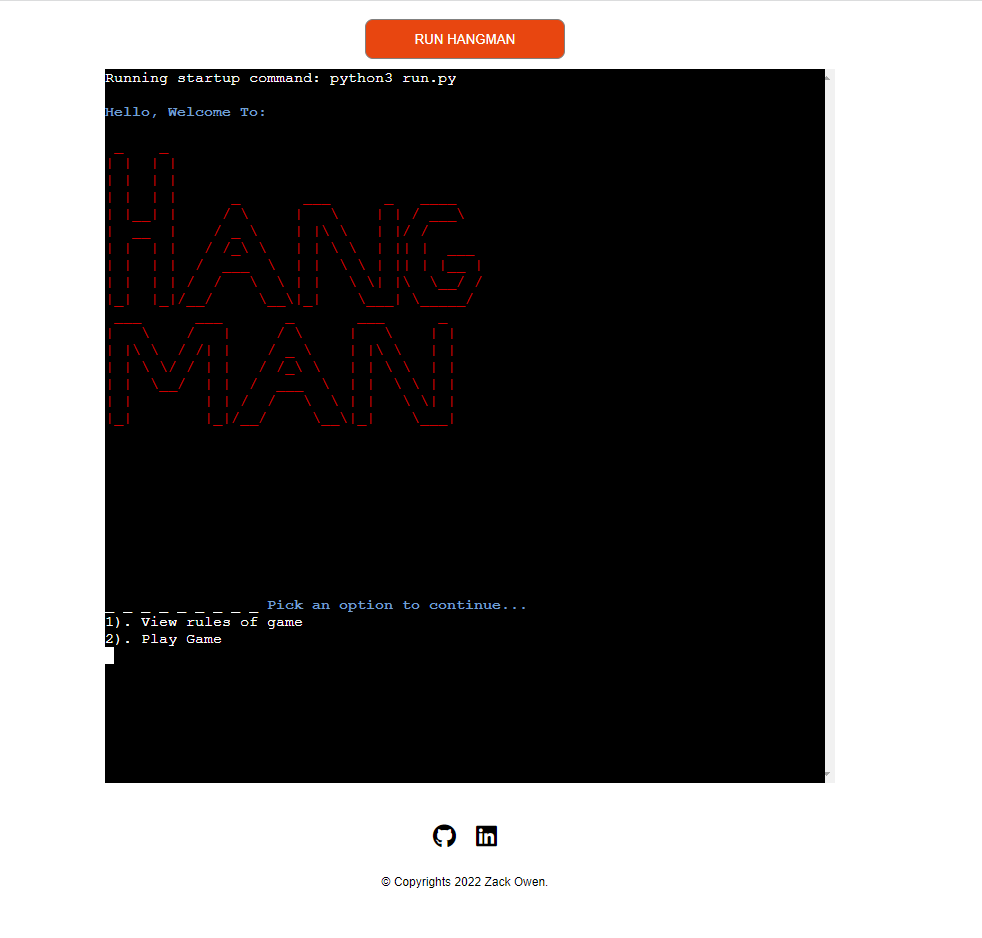
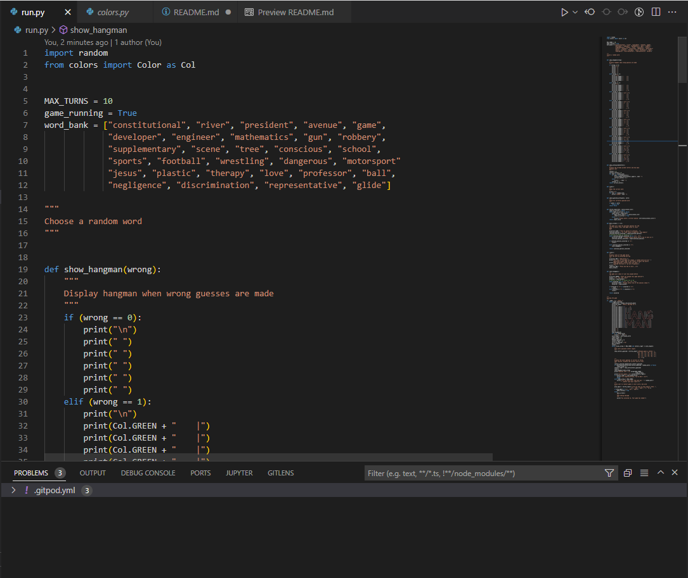
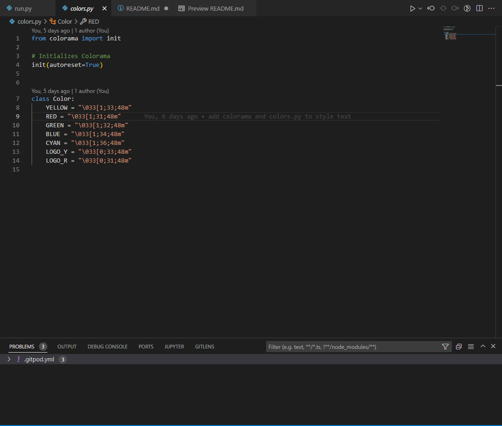

# HANGMAN GAME 

**Developer: Zack Owen**

[Live website](https://hangman-ci-game.herokuapp.com/)

## About

This is a command-line version of the classic Hangman game we all know.

The classic game is played by guessing a randomly generated word by picking an individual letters on each go. Each player will get to keep guessing a letter until they either get the correct word or the hanging man shows. The hanging man will show after 10 incorrect guesses.

The objective of the game is to correctly guess the randomly generated word before the hanging man shows.

## Table of Contents
  - [Project Goals](#project-goals)
    - [User Goals](#user-goals)
    - [Site Owner Goals](#site-owner-goals)
  - [User Experience](#user-experience)
    - [Target Audience](#target-audience)
    - [User Requirements and Expectations](#user-requirements-and-expectations)
    - [User Manual](#user-manual)
  - [User Stories](#user-stories)
    - [Users](#users)
    - [Site Owner](#site-owner)
  - [Technical Design](#technical-design)
    - [Flowchart](#flowchart)
  - [Technologies Used](#technologies-used)
    - [Languages](#languages)
    - [Frameworks & Tools](#frameworks--tools)
    - [Libraries](#libraries)
  - [Features](#features)
  - [Validation](#validation)
  - [Testing](#testing)
    - [Manual Testing](#manual-testing)
    - [Automated Testing](#automated-testing)
  - [Bugs](#bugs)
  - [Deployment](#deployment)
  - [Credits](#credits)
  - [Acknowledgements](#acknowledgements)

## Project Goals

### User Goals

- Play a fun easy game.
- Read the rules before playing.
- Be able to see whether you win or lose

### Site Owner Goals

- Create a game that is user to play for users
- Ensure that users can understand the rules of the game
- Give users feedback whilst playing

## User Experience

### Target Audience

There is no specific target audience as this game can be played by everyone. However I would recommend anyone above the age of 8 to play this game.

### User Requirements and Expectations

- A simple, error-free game
- Easy navigation
- Feedback on game results

### User Manual

Click here to view game instructions

#### Main Menu
On the main menu, users are presented with a custom made Hangman title. Below the title graphic there are 2 options for the user to choose from.
Operation: Input a numeric value or y/n and press enter.
1. View game rules
2. Play game

If at any point the user has inputted an incorrect value, the user will be prompted to try again.

#### Game Rules
With the game rules option, the users are presented with a short message about the game rules, once read the users can return back to the main menu.
Operation: Press any key and hit enter.

#### Play
With the play game option, users are asked if they have played the game before. 
Operation: Input a numeric value.
The extra inputs for available are 'y' for yes or 'n' for no.
1. Yes
2. No

#### Play Again
At the end of the game if the user wins or loses they can select if they want to play again.
Operation: Input a letter value.
1. Y
2. N

#### Go Back To Main Menu
At the end of game the user can return to the main menu if they win or lose.
Operation: Input a letter value.
1. Yes
2. No

Note if the user wins, the game will automatically return to the main menu.

[Back to Table of Contents](#table-of-contents)

## User Stories

### Users

### Site Owner

## Technical Design

### Flowchart

## Technologies Used

### Languages
- [Python](https://www.python.org/) programming language for the logic of the program

### Frameworks & Tools

- [Diagrams.net](https://app.diagrams.net/) was used to draw program flowchart
- [Font Awesome](https://fontawesome.com/) - icons from Font Awesome were used in the footer below the program terminal
- [Git](https://git-scm.com/) was used for version control within VSCode to push the code to GitHub
- [GitHub](https://github.com/) was used as a remote repository to store project code
- [Heroku Platform](https://dashboard.heroku.com/) was used to deploy the project into live environment
- [PEP8](http://pep8online.com/) was used to check my code against Python conventions
- [Visual Studio Code (VSCode)](https://code.visualstudio.com/)
VSCode was used to write the project code using Code Institute template

### Libraries

#### Python Libaries
- random - used to randomly generate a random word with every new game.

#### Third-Party Libraries
- [colorama](https://pypi.org/project/colorama/) - JUSTIFICATION: I used this library to add color to the terminal and enhance user experience. I used Red, Green, Blue and Cyan to help users read the displayed information.

## Features

### Main Menu

### Game Rules

### Play Game Options

### Game

### End Game Options

### Quit Game Message

### Win/Lose Message

[Back to Table Of Contents](#table-of-contents)

## Validation
[PEP8 Validation Service](http://pep8online.com/) was used to check the code for PEP8 requirements. All the code passes with no errors and 0 warnings showing.

PEP8 check for run.py

PEP8 check for colors.py

## Manual Testing

[Back to Table Of Contents](#table-of-contents)

## Bugs

## Deployment

### Heroku
This application has been deployed from GitHub to Heroku by following the steps:

1. Create or log in to your account at heroku.com
2. Create a new app, add a unique app name (this project is named "ci-pp3-connect4") and choose your region
3. Click on create app
4. Go to "Settings"
5. Under Config Vars store any sensitive data you saved in .json file. Name 'Key' field, copy the .json file and paste it to 'Value' field. Also add a key 'PORT' and value '8000'.
6. Add required buildpacks (further dependencies). For this project, I set up 'Python' and 'node.js' in that order.
7. Go to "Deploy" and select "GitHub" in "Deployment method"
8. To link up our Heroku app to our Github repository code enter your repository name, click 'Search' and then 'Connect' when it shows below
9.  Choose the branch you want to buid your app from
10. If prefered, click on "Enable Automatic Deploys", which keeps the app up to date with your GitHub repository
11. Wait for the app to build. Once ready you will see the “App was successfully deployed” message and a 'View' button to take you to your deployed link.

### Forking the GitHub Repository
1. Go to the GitHub repository
2. Click on Fork button in top right corner
3. You will then have a copy of the repository in your own GitHub account.

### Making a Local Clone
1. Go to the GitHub repository 
2. Locate the Code button above the list of files and click it
3. Highlight the "HTTPS" button to clone with HTTPS and copy the link
4. Open Git Bash
5. Change the current working directory to the one where you want the cloned directory
6. Type git clone and paste the URL from the clipboard ($ git clone https://github.com/YOUR-USERNAME/YOUR-REPOSITORY)
7. Press Enter to create your local clone

[Back to Table Of Contents](#table-of-contents)

## Credits

### Images

### Code

## Acknowledgements
