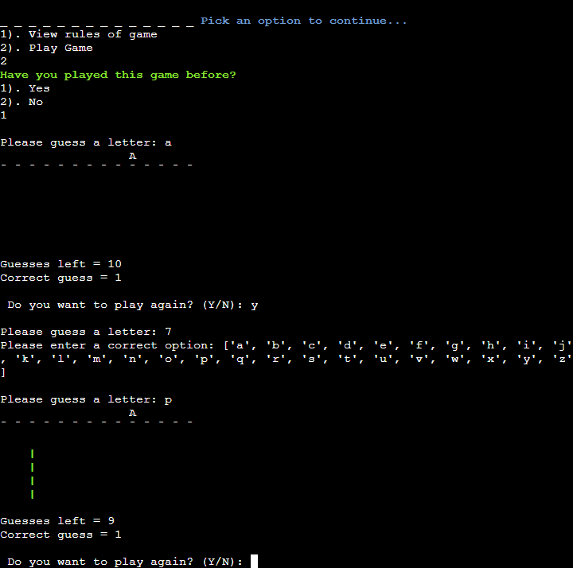

# HANGMAN GAME 

**Developer: Zack Owen**

[Live website](https://hangman-ci-game.herokuapp.com/)

## About

This is a command-line version of the classic Hangman game we all know.

The classic game is played by guessing a randomly generated word by picking an individual letters on each go. Each player will get to keep guessing a letter until they either get the correct word or the hanging man shows. The hanging man will show after 10 incorrect guesses.

The objective of the game is to correctly guess the randomly generated word before the hanging man shows.

## Table of Contents
  - [Project Goals](#project-goals)
    - [User Goals](#user-goals)
    - [Site Owner Goals](#site-owner-goals)
  - [User Experience](#user-experience)
    - [Target Audience](#target-audience)
    - [User Requirements and Expectations](#user-requirements-and-expectations)
    - [User Manual](#user-manual)
  - [User Stories](#user-stories)
    - [Users](#users)
    - [Site Owner](#site-owner)
  - [Technical Design](#technical-design)
    - [Flowchart](#flowchart)
  - [Technologies Used](#technologies-used)
    - [Languages](#languages)
    - [Frameworks & Tools](#frameworks--tools)
    - [Libraries](#libraries)
  - [Features](#features)
  - [Validation](#validation)
  - [Testing](#testing)
    - [Manual Testing](#manual-testing)
    - [Automated Testing](#automated-testing)
  - [Bugs](#bugs)
  - [Deployment](#deployment)
  - [Credits](#credits)
  - [Acknowledgements](#acknowledgements)

## Project Goals

### User Goals

- Play a fun easy game.
- Read the rules before playing.
- Be able to see whether you win or lose

### Site Owner Goals

- Create a game that is user to play for users
- Ensure that users can understand the rules of the game
- Give users feedback whilst playing

## User Experience

### Target Audience

There is no specific target audience as this game can be played by everyone. However I would recommend anyone above the age of 8 to play this game.

### User Requirements and Expectations

- A simple, error-free game
- Easy navigation
- Feedback on game results

### User Manual

Click here to view game instructions

#### Main Menu
On the main menu, users are presented with a custom made Hangman title. Below the title graphic there are 2 options for the user to choose from.
Operation: Input a numeric value or y/n and press enter.
1. View game rules
2. Play game

If at any point the user has inputted an incorrect value, the user will be prompted to try again.

#### Game Rules
With the game rules option, the users are presented with a short message about the game rules, once read the users can return back to the main menu.
Operation: Press any key and hit enter.

#### Play
With the play game option, users are asked if they have played the game before. 
Operation: Input a numeric value.
The extra inputs for available are 'y' for yes or 'n' for no.
1. Yes
2. No

#### Play Again
At the end of the game if the user wins or loses they can select if they want to play again.
Operation: Input a letter value.
1. Y
2. N

#### Go Back To Main Menu
At the end of game the user can return to the main menu if they win or lose.
Operation: Input a letter value.
1. Yes
2. No

Note if the user wins, the game will automatically return to the main menu.

[Back to Table of Contents](#table-of-contents)

## User Stories

### Users

1. I want to have clear options to choose from in the main menu
2. I want to know what the rules are for the game
3. I want to receive feedback when playing the game
4. I want to know if I have won or lost
5. I want to play the game again after winning or losing

### Site Owner

6. I want users to have a good experience whilst playing the game
7. I want users to have easy options when selecting through the main menu
8. I want users to know when they have accidently selected the wrong option/input
9. I want users to know what the correct inputs are when playing the game
10. I want users to quit the game when they want

[Back to Table of Contents](#table-of-contents)

## Technical Design

### Flowchart

The following flowchart shows the structure and logic of the game.

Flowchart

## Technologies Used

### Languages
- [Python](https://www.python.org/) programming language for the logic of the program

### Frameworks & Tools

- [Diagrams.net](https://app.diagrams.net/) was used to draw program flowchart
- [Font Awesome](https://fontawesome.com/) - icons from Font Awesome were used in the footer below the program terminal
- [Git](https://git-scm.com/) was used for version control within VSCode to push the code to GitHub
- [GitHub](https://github.com/) was used as a remote repository to store project code
- [Heroku Platform](https://dashboard.heroku.com/) was used to deploy the project into live environment
- [PEP8](http://pep8online.com/) was used to check my code against Python conventions
- [Visual Studio Code (VSCode)](https://code.visualstudio.com/)
VSCode was used to write the project code using Code Institute template

### Libraries

#### Python Libaries
- random - used to randomly generate a random word with every new game.

#### Third-Party Libraries
- [colorama](https://pypi.org/project/colorama/) - JUSTIFICATION: I used this library to add color to the terminal and enhance user experience. I used Red, Green, Blue and Cyan to help users read the displayed information.

## Features

### Main Menu

- Provides user with graphic welcome message
- Gives users 2 options to select, view game rules or start game
- User stories covered: 1, 7

Main Menu Screenshot

### Game Rules

- Display clear game rules
- Allow users to return to the main menu once read
- User stories covered: 2

Rules Screenshot

### Play Game Options

- Gives user option to play game or read rules
- Asks user if they have played before
- User stories covered: 1

Play Game Screenshot

### Game

- Displays random word as blank
- Shows correct letters guessed
- Displays part of hanging man after incorrect guess
- Gives feedback when user has inputted incorrectly
- Gives option to carry on or quit
- User stories covered: 3, 6, 8, 9

Game Screenshot

### End Game Options

- Asks user if they want to play again
- Display win or lose message at the end of the game
- User stories covered: 4, 5

End Game Screenshot

### Quit Game Message

- Displays message after every go to quit or carry on
- User stories covered: 3, 10

Quit Game Screenshot

### Win/Lose Message

- Display win or lose message
- User stories covered: 4, 5

Win/Lose Screenshot

[Back to Table Of Contents](#table-of-contents)

## Validation
[PEP8 Validation Service](http://pep8online.com/) was used to check the code for PEP8 requirements. All the code passes with no errors and 0 warnings showing.

PEP8 check for run.py

PEP8 check for colors.py

## Manual Testing

See user stories testing

1. I want to have clear options to choose from in the main menu

| **Feature**   | **Action**                    | **Expected Result**          | **Actual Result** |
| ------------- | ----------------------------- | ---------------------------- | ----------------- |
| Main menu | Select option 1 | Users are presented with game rules | Works as expected |
| Main menu | Select option 2 | Users are asked if they played the game before | Works as expected |

Testing Screenshot

2. I want to know what the rules are for the game

| **Feature**   | **Action**                    | **Expected Result**          | **Actual Result** |
| ------------- | ----------------------------- | ---------------------------- | ----------------- |
| Main menu | Select option 1 | Users are presented with game rules | Works as expected |

Testing Screenshot

3. I want to receive feedback when playing the game

| **Feature**   | **Action**                    | **Expected Result**          | **Actual Result** |
| ------------- | ----------------------------- | ---------------------------- | ----------------- |
| Feedback | Please enter a correct input | Users are asked to input a correct option when guessing a letter | Works as expected |

Testing Screenshot

4. I want to know if I have won or lost

| **Feature**   | **Action**                    | **Expected Result**          | **Actual Result** |
| ------------- | ----------------------------- | ---------------------------- | ----------------- |
| Win/Lose message | Win or lose the game | Display the appropriate message when user win or loses | Works as expected |

Testing Screenshot

5. I want to play the game again after winning or losing

| **Feature**   | **Action**                    | **Expected Result**          | **Actual Result** |
| ------------- | ----------------------------- | ---------------------------- | ----------------- |
| Restart game after win/lose | Reloads the main menu after win or lose | Game reloads to the main menu when game has ended | Works as expected |

Testing Screenshot

6. I want users to have a good experience whilst playing the game

| **Feature**   | **Action**                    | **Expected Result**          | **Actual Result** |
| ------------- | ----------------------------- | ---------------------------- | ----------------- |
| Easy UI and easy to understand game mechanics and rules | Easy instructions and easy to read information | Easy to follow instructions and game runs and displays messages to a readable level | Works as expected |

Testing Screenshot

7. I want users to have easy options when selecting through the main menu

| **Feature**   | **Action**                    | **Expected Result**          | **Actual Result** |
| ------------- | ----------------------------- | ---------------------------- | ----------------- |
| Multiple options to select | Options in main menu by selecting correct input | When user selects '1' or '2' they are taken to a different section of the game | Works as expected |

Testing Screenshot

8. I want users to know when they have accidently selected the wrong option/input

| **Feature**   | **Action**                    | **Expected Result**          | **Actual Result** |
| ------------- | ----------------------------- | ---------------------------- | ----------------- |
| Correct Input message | Enter an incorrect input | Message displays when user has inputted a wrong action/input | Works as expected |

Testing Screenshot

9. I want users to know what the correct inputs are when playing the game

| **Feature**   | **Action**                    | **Expected Result**          | **Actual Result** |
| ------------- | ----------------------------- | ---------------------------- | ----------------- |
| Display appropriate inputs | Press a wrong input | Select a wrong input, message appears to tell user the appropriate inputs | Works as expected |

Testing Screenshot

10. I want users to quit the game when they want

| **Feature**   | **Action**                    | **Expected Result**          | **Actual Result** |
| ------------- | ----------------------------- | ---------------------------- | ----------------- |
| Exiting the game | Can exit the game at any point | User can say no after being asked if they want to carry on after each guess | Works as expected | 

Testing Screenshot

[Back to Table Of Contents](#table-of-contents)

## Bugs

| **Bug** | **Fix** |
| ------- | ------- |
| When selecting 'yes' during have you played before, the rules would show anyways | Removed rules code from __name__ |
| When selecting 'no' after being asked if you want to play again, the game would carry on playing | Add code to return back to main menu |
| LinkedIn icon would not take user to linkedin page | Add pointer cursor and we copied page link |
| There were quite a few errors and warnings related to exceeded number of characters in line, whitespace within a blank line, trailing white spaces or missing white spaces around operators | Split the comments or print functions into two separate rows maintaining correct indentation. Followed a guidance within pep8 online tool and corrected all warnings and errors |
| Bottom part of the hangman wouldn't show | Add an extra print(" ") line to the bottom of each print out section |

## Deployment

### Heroku
This application has been deployed from GitHub to Heroku by following the steps:

1. Create or log in to your account at heroku.com
2. Create a new app, add a unique app name (this project is named "ci-pp3-connect4") and choose your region
3. Click on create app
4. Go to "Settings"
5. Under Config Vars store any sensitive data you saved in .json file. Name 'Key' field, copy the .json file and paste it to 'Value' field. Also add a key 'PORT' and value '8000'.
6. Add required buildpacks (further dependencies). For this project, I set up 'Python' and 'node.js' in that order.
7. Go to "Deploy" and select "GitHub" in "Deployment method"
8. To link up our Heroku app to our Github repository code enter your repository name, click 'Search' and then 'Connect' when it shows below
9.  Choose the branch you want to buid your app from
10. If prefered, click on "Enable Automatic Deploys", which keeps the app up to date with your GitHub repository
11. Wait for the app to build. Once ready you will see the “App was successfully deployed” message and a 'View' button to take you to your deployed link.

### Forking the GitHub Repository
1. Go to the GitHub repository
2. Click on Fork button in top right corner
3. You will then have a copy of the repository in your own GitHub account.

### Making a Local Clone
1. Go to the GitHub repository 
2. Locate the Code button above the list of files and click it
3. Highlight the "HTTPS" button to clone with HTTPS and copy the link
4. Open Git Bash
5. Change the current working directory to the one where you want the cloned directory
6. Type git clone and paste the URL from the clipboard ($ git clone https://github.com/YOUR-USERNAME/YOUR-REPOSITORY)
7. Press Enter to create your local clone

[Back to Table Of Contents](#table-of-contents)

## Credits

### Images
- [Flaticon](https://www.flaticon.com/free-icon/connect_1707222) was used for the website favicon

### Code
- [Pypi](https://pypi.org/project/colorama/) was used to help with the colour codes for Colorama colours.
- Code Institute - for git template IDE and how to deploy to Heroku.
- [Ozzmaker](https://ozzmaker.com/add-colour-to-text-in-python/) and [Stackabuse](https://stackabuse.com/how-to-print-colored-text-in-python/) for help with how to add coloured text into Python.
- [Shaun Halverson](https://www.youtube.com/watch?v=pFvSb7cb_Us&t=617s&ab_channel=ShaunHalverson) I used part of Shaun's code to make the hangman design and how to implement MAX_TURNS
- [Python Tutorial](https://python.tutorialink.com/python-lint-issue-invalid-escape-sequence/) for helping me with invalid escape sequence error.
## Acknowledgements
I would like to thank everyone who supported me in the development of this project:
- My mentor Mo for professional guidance, helpful feedback and words of encouragement whilst creating the project. Also, for encouraging me to learn about the unit test and including it within this project.
- My partner for his support and playing/testing the game with me
- Code Institute community on Slack for resources and support. A special thank you to @Wozza_5P , @Aldwin Arriola , @Matthew Hobbs_Hurrell_5P for helping with my errors.